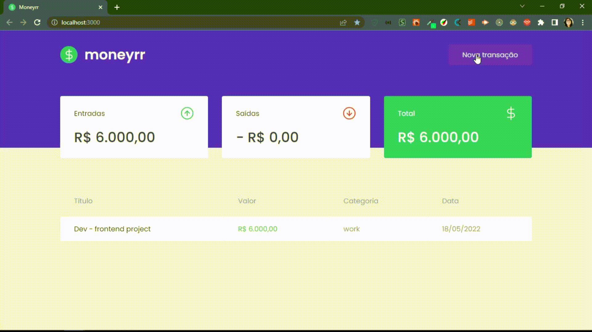

<h1 align="center">Moneyrr</h1>

<blockquote align="center">“A chave para transformação é a continuidade. Continue a codar!!!”</blockquote>

 

 
 

## Sumário

- [Apresentação](#apresentação)
- [Sobre o Projeto](#sobre-o-projeto)
- [Tecnologias utilizadas](#tecnologias-utilizadas)

 

# Apresentação

 

  

 

## Sobre o Projeto

 

No módulo estudado do curso Ignite da Rocketseat foi construida uma aplicação de transações financeiras para acompanhamento de entradas e saídas de despesas. É uma aplicação front-end web completa que utiliza de conceitos e ferramentas importantes do ecossistema React.

Nessa aplicação foram utlizadas as seguites tecnologias e conceitos:</a>

* ReactJS;
* Typescript;
* Styled Components;
* MirageJS;
* Context API;
* Axios.

 

## Tecnologias Utilizadas

 

<code></code>
<code></code>
<code></code>

 
 

 
 

<h3 align="center">
    
</h3>
